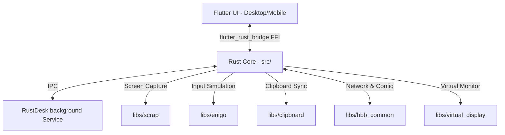

# RustDesk / Anuvadini Project Code Structure

This document provides a comprehensive overview of the RustDesk code structure. It details the purpose of each directory, key modules, sub-crates, and class/model hierarchies, helping new and existing developers understand how the system is put together.

---

## 🏗️ Architecture Overview

RustDesk (branded here as Anuvadini) is a remote desktop solution built with a **Rust Core** backend and a **Flutter** UI frontend.



---

## 📂 Core Folder Structure

```
rustdesk/
├── .cargo/               # Cargo settings and configuration
├── assets/               # Shared non-UI assets (icons, build tools, etc.)
├── docs/                 # Documentation files
├── flutter/              # Flutter UI application (Desktop & Mobile)
│   ├── android/          # Android project configuration and native code
│   ├── ios/              # iOS project configuration
│   ├── lib/              # Flutter Dart source code
│   │   ├── common/       # Shared Dart utilities and state keys
│   │   ├── desktop/      # UI components and pages for Desktop (macOS, Windows, Linux)
│   │   ├── mobile/       # UI components and pages for Mobile (Android, iOS)
│   │   ├── models/       # State management models (using ChangeNotifier/Provider pattern)
│   │   ├── native/       # Dart FFI wrappers interacting with generated Rust code
│   │   ├── plugin/       # Plugin interfaces and system integrations
│   │   └── utils/        # General helpers (routing, translations, screen adjustment)
│   └── web/              # Web application entrypoints
├── libs/                 # Local Rust libraries & sub-crates
│   ├── clipboard/        # Low-level cross-platform clipboard reader/writer
│   ├── enigo/            # Low-level cross-platform input simulation (mouse & keyboard)
│   ├── hbb_common/       # Common modules (config, protocols, WebRTC, Nostr)
│   ├── remote_printer/   # Driver & printing handlers for remote printing features
│   ├── scrap/            # Low-level cross-platform screen/frame capture
│   └── virtual_display/  # Virtual display driver integration (Windows/Linux)
└── src/                  # Main Rust core implementation
    ├── client/           # Client-side session and decoding loop
    ├── server/           # Server-side capturing, encoding, input injection, and service loop
    ├── platform/         # Native operating system wrappers (WinAPI, Cocoa, GTK)
    ├── ui/               # Legacy Sciter desktop UI implementation (fallback)
    └── client.rs / server.rs  # Main logic runners for client and server modes
```

---

## 🦀 Rust Core (`src/`)

The `src/` directory contains the main execution logic for RustDesk. It determines whether to run as a **client** (viewing a remote screen), a **server/service** (sharing the local screen), or a **CLI tool**.

### Key Modules and Entrypoints

*   **[main.rs](file:///c:/Users/jatin/Downloads/rustdesk/src/main.rs)**
    *   **Role**: The application entry point. Parses command-line arguments and determines the mode to spin up (service, desktop UI, tray, or command helper).
*   **[core_main.rs](file:///c:/Users/jatin/Downloads/rustdesk/src/core_main.rs)**
    *   **Role**: Initializes the main background loop. Prepares logging, loads configs, and sets up system tray configurations.
*   **[client.rs](file:///c:/Users/jatin/Downloads/rustdesk/src/client.rs)** & **[src/client/](file:///c:/Users/jatin/Downloads/rustdesk/src/client/)**
    *   **Role**: Manages active connection client sessions.
    *   `src/client/io_loop.rs`: The core connection event loop for the client. Handles incoming video frames, audio packages, file transfer packages, and sends mouse/keyboard input events.
    *   `src/client/screenshot.rs`: Captures screenshot of remote sessions locally.
*   **[server.rs](file:///c:/Users/jatin/Downloads/rustdesk/src/server.rs)** & **[src/server/](file:///c:/Users/jatin/Downloads/rustdesk/src/server/)**
    *   **Role**: Handles screen sharing, input injection, and hosting connections.
    *   `src/server/connection.rs`: Coordinates incoming client sessions, handling authentication, encryption handshakes, and command channels.
    *   `src/server/video_service.rs`: Captures screens using `libs/scrap` and encodes them into VP8, VP9, H.264, or H.265 frames.
    *   `src/server/input_service.rs`: Receives remote inputs (key/mouse coordinates) and dispatches them to simulated input API (`libs/enigo`).
    *   `src/server/audio_service.rs`: Captures system audio loopback and encodes it.
    *   `src/server/clipboard_service.rs`: Monitors clipboard modifications and relays changes to connected clients.
    *   `src/server/terminal_service.rs` / `terminal_helper.rs`: Manages remote terminal/shell integration.
*   **[ipc.rs](file:///c:/Users/jatin/Downloads/rustdesk/src/ipc.rs)**
    *   **Role**: Handles Inter-Process Communication (IPC). The RustDesk service runs as a system-level daemon, while the user interface runs in user-space. `ipc.rs` handles secure pipes/sockets communication between these processes.
*   **[flutter.rs](file:///c:/Users/jatin/Downloads/rustdesk/src/flutter.rs)** & **[flutter_ffi.rs](file:///c:/Users/jatin/Downloads/rustdesk/src/flutter_ffi.rs)**
    *   **Role**: Contains the Rust-side FFI APIs exposed to Flutter via `flutter_rust_bridge`. Defines how Dart invokes Rust routines (e.g. `start_connection()`, `send_key_event()`).
*   **[platform/](file:///c:/Users/jatin/Downloads/rustdesk/src/platform/)**
    *   **Role**: OS-specific hook integrations.
    *   `windows.rs` / `windows.cc`: Windows integrations (UAC elevate, session switching, service management, registry configs).
    *   `macos.rs` / `macos.mm`: macOS integration (Accessibility permissions, service helper plist management).
    *   `linux.rs` / `gtk_sudo.rs`: Linux integrations (Polkit authentication, Systemd service handlers, Wayland/X11 wrappers).
*   **[rendezvous_mediator.rs](file:///c:/Users/jatin/Downloads/rustdesk/src/rendezvous_mediator.rs)**
    *   **Role**: Connects to the rendezvous server to coordinate peer-to-peer connection handshakes, NAT traversal, STUN/TURN queries, and TCP/UDP hole punching.
*   **[virtual_display_manager.rs](file:///c:/Users/jatin/Downloads/rustdesk/src/virtual_display_manager.rs)**
    *   **Role**: Spawns and manages virtual monitors on the host machine to support multi-monitor remote sessions without physical displays attached.

---

## 📦 Sub-crates and Libraries (`libs/`)

To keep compilation modular, hardware interaction and data structures are grouped into sub-crates located in `libs/`.

*   **[libs/hbb_common/](file:///c:/Users/jatin/Downloads/rustdesk/libs/hbb_common/)**
    *   **config.rs**: Houses local and server configuration structures (ID, password, relays, custom server domains, security permissions).
    *   **webrtc.rs**: Manages peer connection setup when connecting via WebRTC instead of direct UDP/KCP.
    *   **protos/**: Protocol Buffers definitions. Dictates the binary format of remote events (frame headers, cursor movements, file packets).
*   **[libs/scrap/](file:///c:/Users/jatin/Downloads/rustdesk/libs/scrap/)**
    *   **Role**: Multi-platform screen-grabber library.
    *   Contains implementations for:
        *   `dxgi/`: Direct3D Desktop Duplication API (Windows).
        *   `quartz/`: Quartz Display Services (macOS).
        *   `x11/` & `wayland/`: Linux capture backends.
        *   `android/`: MediaProjection APIs.
*   **[libs/enigo/](file:///c:/Users/jatin/Downloads/rustdesk/libs/enigo/)**
    *   **Role**: Virtual input simulator (mouse click, cursor move, keyboard keystroke events). Dispatches inputs to native APIs (e.g., `SendInput` on Windows, CoreGraphics events on macOS, or `/dev/uinput` / `XTest` on Linux).
*   **[libs/clipboard/](file:///c:/Users/jatin/Downloads/rustdesk/libs/clipboard/)**
    *   **Role**: Native system clipboard API connector. Handles text copy-paste, rich data, and file path copy/paste.
*   **[libs/virtual_display/](file:///c:/Users/jatin/Downloads/rustdesk/libs/virtual_display/)**
    *   **Role**: Interacts with kernel drivers (like IddSampleDriver on Windows) to create plug-and-play virtual monitors dynamically.

---

## 📱 Flutter Frontend (`flutter/lib/`)

The UI is built with Flutter and communicated through auto-generated Dart bindings generated by `flutter_rust_bridge`.

```
flutter/lib/
├── common.dart            # Theme definitions, global helpers, shared methods
├── consts.dart            # Layout sizes, network ports, asset paths
├── generated_bridge.dart  # Auto-generated FFI interface linking Dart classes to Rust
├── main.dart              # Flutter startup, theme initialization, routing
├── desktop/               # Desktop UI files
│   └── pages/             # Pages (home, remote viewer, settings, file manager)
├── mobile/                # Mobile UI files
│   └── pages/             # Pages (mobile viewer, scan, connection screen)
└── models/                # UI state models and bindings
```

### State Management (`flutter/lib/models/`)

The UI relies heavily on a ChangeNotifier-based model structure to orchestrate active sessions, updates, and UI bindings:

*   **[model.dart](file:///c:/Users/jatin/Downloads/rustdesk/flutter/lib/models/model.dart)**
    *   **Role**: The primary state management container. Contains structures for active peers (recent connections), custom server configurations, local credentials, and overall app lifecycle events.
*   **[input_model.dart](file:///c:/Users/jatin/Downloads/rustdesk/flutter/lib/models/input_model.dart)**
    *   **Role**: Formats and processes touch controls, gesture events (pinching, dragging), mouse movement, and keyboard shortcuts, translating them into packages Rust expects.
*   **[ab_model.dart](file:///c:/Users/jatin/Downloads/rustdesk/flutter/lib/models/ab_model.dart)**
    *   **Role**: Address Book state management. Handles contact groups, custom peer tags, sync-to-cloud server, and quick-connect nodes.
*   **[chat_model.dart](file:///c:/Users/jatin/Downloads/rustdesk/flutter/lib/models/chat_model.dart)**
    *   **Role**: Stores chat message history exchanged between the viewer client and the remote host during a session.
*   **[server_model.dart](file:///c:/Users/jatin/Downloads/rustdesk/flutter/lib/models/server_model.dart)**
    *   **Role**: Synchronizes settings panel configurations (e.g. enabling remote control, file transfer permissions, TCP tunneling settings) back into Rust's configuration backend.

### UI Screens and Layouts (`flutter/lib/desktop/pages/` & `flutter/lib/mobile/pages/`)

*   **`connection_page.dart`**
    *   **Role**: The landing screen (homepage). Shows the local ID, remote control input text-field, recent connection cards, and address book list.
*   **`remote_page.dart`**
    *   **Role**: The session viewport. Integrates the video renderer textures coming from Rust, overlay control toolbar (change resolution, quality, view modes), and captures mouse/keyboard interactions.
*   **`file_manager_page.dart`**
    *   **Role**: Split-pane file browser layout. Lets users copy, transfer, rename, and delete folders between the local storage and remote host.
*   **`terminal_page.dart`**
    *   **Role**: Renders a terminal emulator (PTY wrapper) connected to the host system shell for headless administration.

---

## 🔗 Data Flow and FFI Binding

When a user initiates remote control from Flutter, the system operates as follows:

```
[Flutter UI Page]
       │
       ▼ (invokes method)
[model.dart / native_model.dart]
       │
       ▼ (serializes arguments and calls FFI)
[generated_bridge.dart]
       │
       ▼ (native FFI call)
[src/flutter_ffi.rs]
       │
       ▼ (starts async connection)
[src/client/io_loop.rs] <======== [Network packets] ========> [Remote Server Engine]
```

Similarly, video frames generated on the remote end are passed back as raw byte textures via callbacks in the FFI bridge, which are rendered on Flutter using texture widgets (`desktop_render_texture.dart`).
