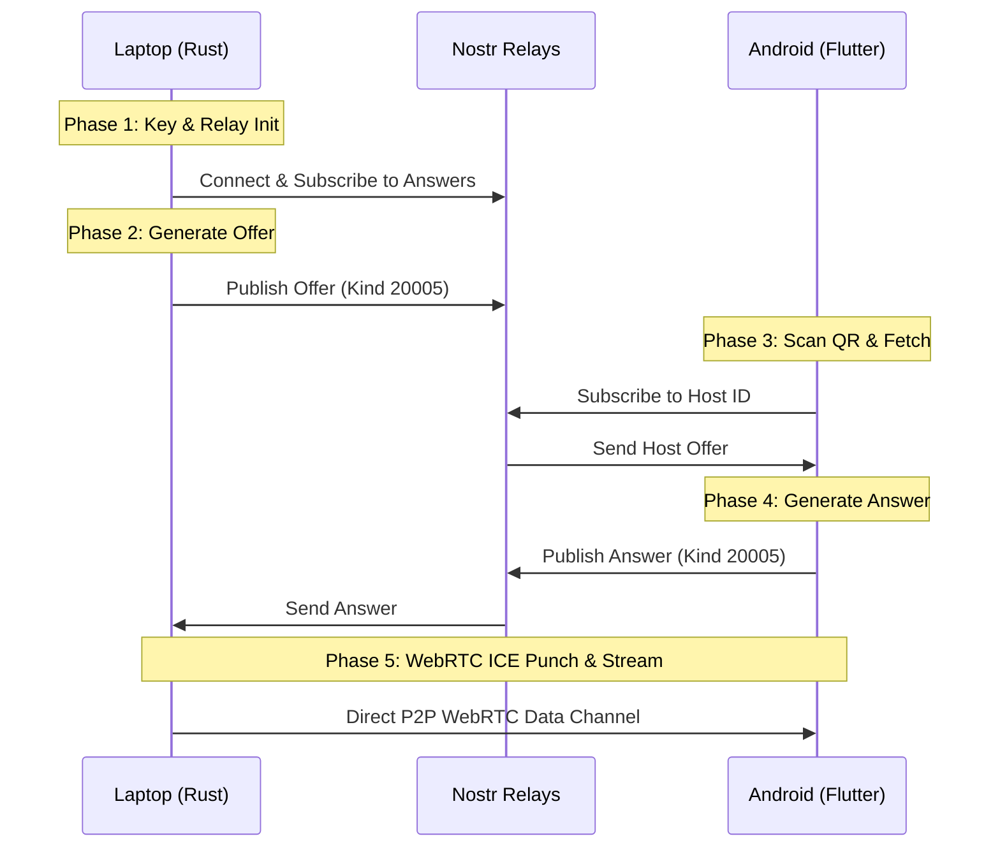

# Decentralized Nostr-Signaled WebRTC P2P remote desktop

This implementation plan details the integration of the Nostr protocol as a serverless signaling mesh and WebRTC data channels as the direct P2P transport layer. This eliminates the need for central relay servers (`hbbr`), custom API servers, and credit-card gated Cloudflare subscriptions.

---

## User Review Required

> [!IMPORTANT]
> **WebRTC Feature Flag Compilation:**
> The codebase contains an existing WebRTC implementation in `libs/hbb_common/src/webrtc.rs` which depends on the `webrtc` crate (version `0.14.0`). We must ensure the `webrtc` Rust feature compiles cleanly on the host OS (Windows) and target platforms (Android). 

> [!WARNING]
> **STUN/TURN Fallback:**
> Direct WebRTC peer connections will succeed for ~80% of networks (including CGNAT to standard NAT). If both host and client are behind strict Symmetric NATs (e.g., corporate enterprise firewalls), they will require a TURN relay server. We must define whether to include public TURN fallbacks in the default ICE configuration or restrict connections to direct P2P.

---

## Open Questions

> [!IMPORTANT]
> 1. Should we encrypt the SDP payload before publishing to Nostr relays? (Recommended: Yes, using ECDH key exchange derived from the QR code's public key to prevent local IP/network structure exposure).
> 2. Do you have preferred default Nostr relays, or should we use standard defaults (`wss://relay.damus.io`, `wss://nos.lol`, `wss://relay.primal.net`)?

---

## Proposed Changes

### Cargo Workspace Configurations

#### [MODIFY] [Cargo.toml](file:///c:/Users/jatin/Downloads/rustdesk/Cargo.toml)
* Add `webrtc = ["hbb_common/webrtc"]` to the `[features]` section to propagate the feature flag from the shared library.
* Add `nostr-sdk = "0.29"` or a lightweight WebSocket-based client to the workspace dependencies for handling relay publishing.

#### [MODIFY] [libs/hbb_common/Cargo.toml](file:///c:/Users/jatin/Downloads/rustdesk/libs/hbb_common/Cargo.toml)
* Ensure `webrtc` feature dependencies are enabled and compile cleanly with the newer versions of Rust.

---

### Rust Core (Host signaling & Handshake)

#### [NEW] [nostr_signaling.rs](file:///c:/Users/jatin/Downloads/rustdesk/src/nostr_signaling.rs)
* Implement the background manager for connection initialization.
* Generate temporary key pairs for the session (or load device keys).
* Expose `publish_webrtc_offer(device_id: &str, sdp: &str)` to send Kind 20005 events.
* Expose `subscribe_for_answers(device_id: &str)` to listen for the client's answer and apply it.

#### [MODIFY] [client.rs](file:///c:/Users/jatin/Downloads/rustdesk/src/client.rs)
* Hook the connection path to direct to `Stream::WebRTC` when receiving incoming signaling handshakes instead of default TCP sockets.

---

### Flutter Client (Android App)

#### [MODIFY] [scan_page.dart](file:///c:/Users/jatin/Downloads/rustdesk/flutter/lib/mobile/pages/scan_page.dart)
* Update QR scanner parsing logic to handle custom `nostr-webrtc://<device_id>#<pubkey>` scheme.
* Establish a temporary WebSocket connection to Nostr relays to fetch the host's offer.

#### [NEW] [webrtc_signaling.dart](file:///c:/Users/jatin/Downloads/rustdesk/flutter/lib/mobile/pages/webrtc_signaling.dart)
* Dart-side implementation of the Nostr client connection.
* Listens for the SDP offer event, decodes it, passes it to the native FFI to generate the answer, and publishes the answer back to the relay.

---

## Detailed Implementation Phases



### Phase 1: Identity & Connection Initialization
1. Generate an Ed25519/Secp256k1 keypair on Host startup.
2. Initialize background connections to 3 default Nostr relays.

### Phase 2: Host SDP Generation & Ephemeral Broadcast
1. Call `WebRTCStream::new("", false, 30000)` to create the local description and gather local candidates.
2. Wrap the offer in `webrtc://<base64_sdp>`.
3. Publish to relays under **Kind 20005** with the tag `["t", "<device_id>"]`.

### Phase 3: Client Discovery & Offer Pickup
1. Client parses the scanned target code.
2. Client queries the Nostr relays for the latest Kind 20005 event matching the `device_id`.
3. Client extracts and decodes the SDP offer string.

### Phase 4: Client Answer & ICE Punching
1. Client initializes its local peer connection using the Host offer, creating an Answer.
2. Client publishes the Answer back to the Nostr relays under tag `["t", "<device_id>_answer"]`.
3. Host receives the answer, sets the remote description, and lets the WebRTC stack execute the ICE hole-punching protocol using the configured STUN servers.

### Phase 5: Stream Handover & Cleanup
1. Once the WebRTC data channel is established, shut down the Nostr WebSocket subscriptions to free up device memory and network bandwidth.
2. Direct all video frames and control messages through the open data channel.

---

## Verification Plan

### Automated Tests
* Build and run the WebRTC test example:
  ```bash
  cargo run --features webrtc --example webrtc
  ```
* Test Nostr event publishing and subscription using a mock client script.

### Manual Verification
* Run the Rust host on a Windows machine.
* Scan the host QR code using the modified Android Flutter client.
* Verify that the handshake finishes over the Nostr relays and that the screen session starts successfully over a mobile 5G network.
